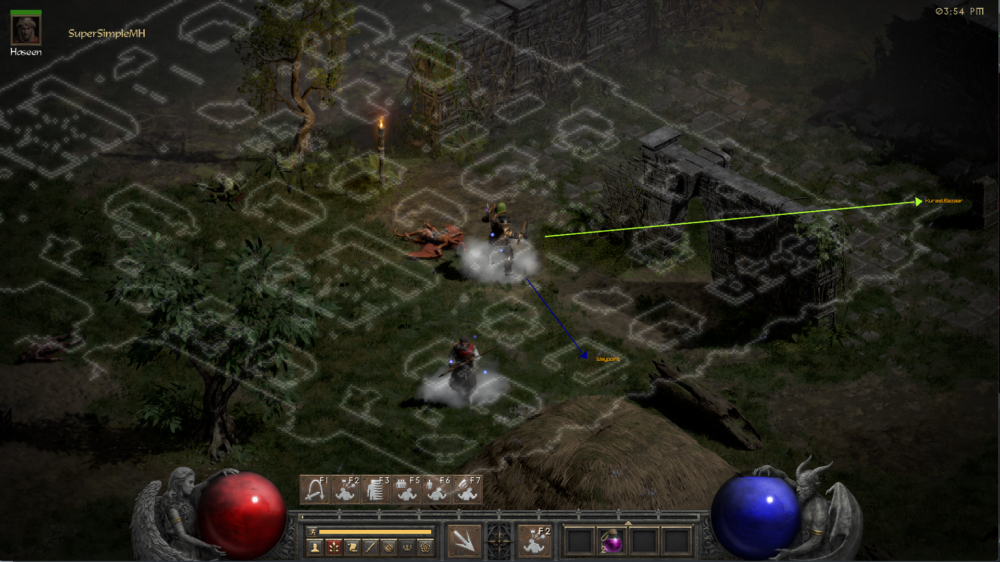
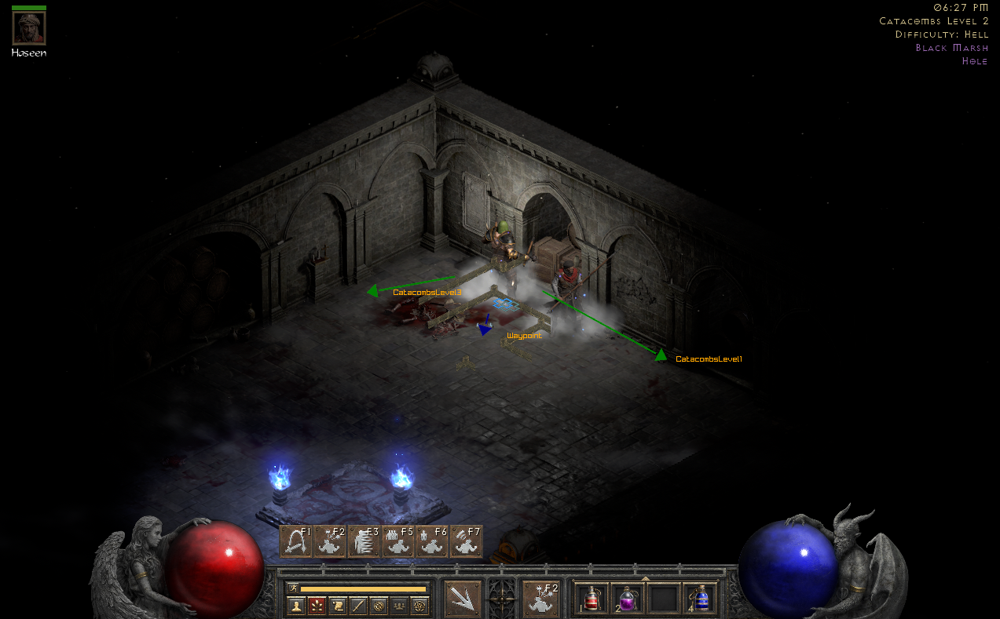

# SuperSimpleMH
### Diablo 2 Resurrected map directions. A tool which direct to key points in the game map.

## Requirements
* Diablo 2 lod version 1.13c
* python 3.11 32-bit version
* python 3.11 64-bit version
* pyMeow module - https://github.com/qb-0/pyMeow

## Setup
* install python 3.11 32-bit version
* install python 3.11 64-bit version
* download diablo 2 lod version 1.13c, you can download from here https://www.mediafire.com/file/3x7g0nuph242mu1/game.zip/file
* download pyMeow module (from releases) to the project folder
* open settings.toml and write the absolute path of diablo 2 lod folder that you've just downloaded
* from the project directory open a command shell prompt and run "python tools\build.py"
* run "\venv\Scripts\activate"
* run "super_simple_mh"

## Features
* map directions to adjacent levels and mazes.
* map overlay
* drawing monster and their immunities
* drawing super uniques, uniques and champions
* drawing merc and player minions
* drawing hostile players and their life
* hover over players to check their stats - deprecated in this release
* display other players inventory

## Credits
* [mapview](https://github.com/joffreybesos/d2r-mapview) @joffreybesos for rustdecrypt and many more.
* MapAssit @OneXDeveloper @ItzRabbs
* [d2mapapi](https://github.com/jcageman/d2mapapi)

LowerKurast                |  Catacombs
:-------------------------:|:-------------------------:
  |  
