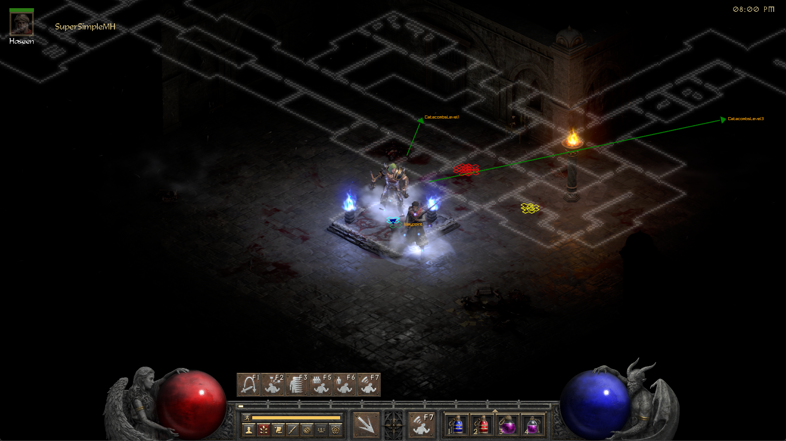

# SuperSimpleMH
### Diablo 2 Resurrected map directions. A tool which direct to key points in the game map.

## Requirements
* python 3.11 32-bit version
* python 3.11 64-bit version
* pyMeow module - https://github.com/qb-0/pyMeow

## Setup
* install python 3.11 32-bit version
* install python 3.11 64-bit version
* download pyMeow module (from releases) to the project folder
* from the project directory open a command shell prompt and run "python tools\build.py"
* run "\venv\Scripts\activate"
* run "super_simple_mh"

## Features
* map directions to adjacent levels and mazes.

## Credits
* [mapview](https://github.com/joffreybesos/d2r-mapview) @joffreybesos for rustdecrypt and many more.
* MapAssit @OneXDeveloper @ItzRabbs
* [d2mapapi](https://github.com/jcageman/d2mapapi)

DuranceOfHate              |  Catacombs
:-------------------------:|:-------------------------:
  |  
