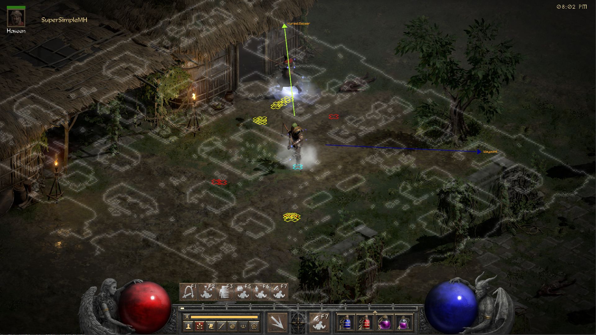

# SuperSimpleMH
### Diablo 2 Resurrected map directions. A tool which direct to key points in the game map.
#### SuperSimpleMH is intended for informational and educational purposes only. By using this tool online you take the risk of being banned.

## Requirements
* Diablo 2 lod version 1.13c
* python 3.11 32-bit version
* python 3.11 64-bit version
* pyMeow module - https://github.com/qb-0/pyMeow (only required with SELF setup see below)

## FAST Setup
1) install python 3.11 32-bit version
2) install python 3.11 64-bit version 
3) download SuperSimpleMH.zip from the releases
4) download diablo 2 lod version 1.13c, you can download from here https://www.mediafire.com/file/3x7g0nuph242mu1/game.zip/file
5) open settings.toml (in rpyc-d2-map-api folder), write the absolute path of diablo 2 lod folder that you've just downloaded 
6) from the project directory (SuperSimpleMH folder) execute "run.bat" as admin, PRESS 1 and then ENTER
7) make sure there are no ERRORS

## SELF Setup
1) do step 1-5 from FAST Setup
2) download pyMeow module from releases or compile it your self
3) from rpyc-d2-map-api directory open command shell prompt and run the commands:
   1) py -3.11-32 -m venv venv
   2) .\venv\Scripts\activate"
   3) pip install wheel
   4) pip install . 
4) from the project directory (SuperSimpleMH folder) open a command shell prompt and run the commands:
   1) py -3.11-64 -m venv venv
   2) .\venv\Scripts\activate
   3) pip install .
   4) pip install pyMeow*.zip

## Usage
* to use SuperSimpleMH take the following steps:
  * start D2R
  * from the project directory (SuperSimpleMH folder) execute "run.bat" as admin PRESS 2 and then ENTER

## Features
* map directions to adjacent levels and mazes.
* map overlay
* drawing monster and their immunities
* drawing super uniques, uniques and champions
* drawing merc and player minions
* drawing hostile players and their life
* display other players stats
* display other players inventory

## SuperSimpleMH Features Usage
* display other players inventory - hover over a player and press insert. press pgup to view items on switch
* display other players stats - hover over a player and press pgdn.

## Credits
* [mapview](https://github.com/joffreybesos/d2r-mapview) @joffreybesos for rustdecrypt and many more.
* MapAssist @OneXDeveloper @ItzRabbs
* [d2mapapi](https://github.com/jcageman/d2mapapi)

LowerKurast                |  Catacombs
:-------------------------:|:-------------------------:
  |  

Show Inventory             |  Show Stats
:-------------------------:|:-------------------------:
  |  
